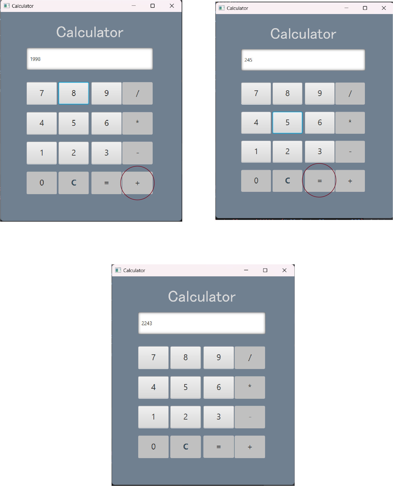
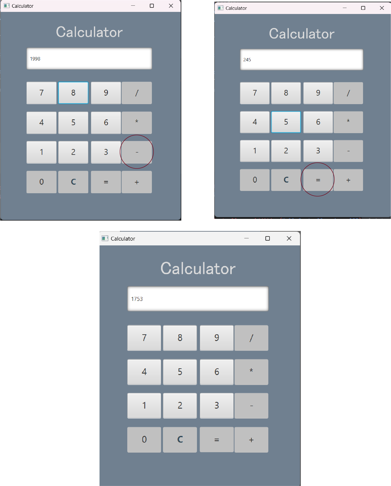
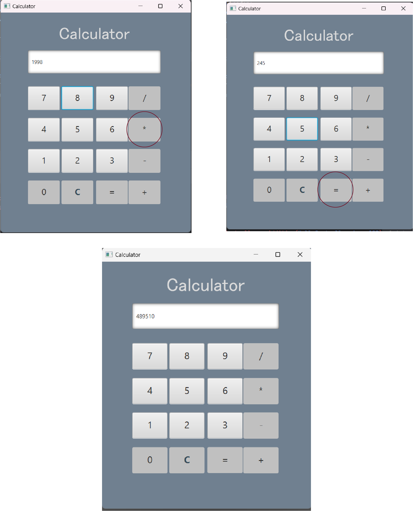
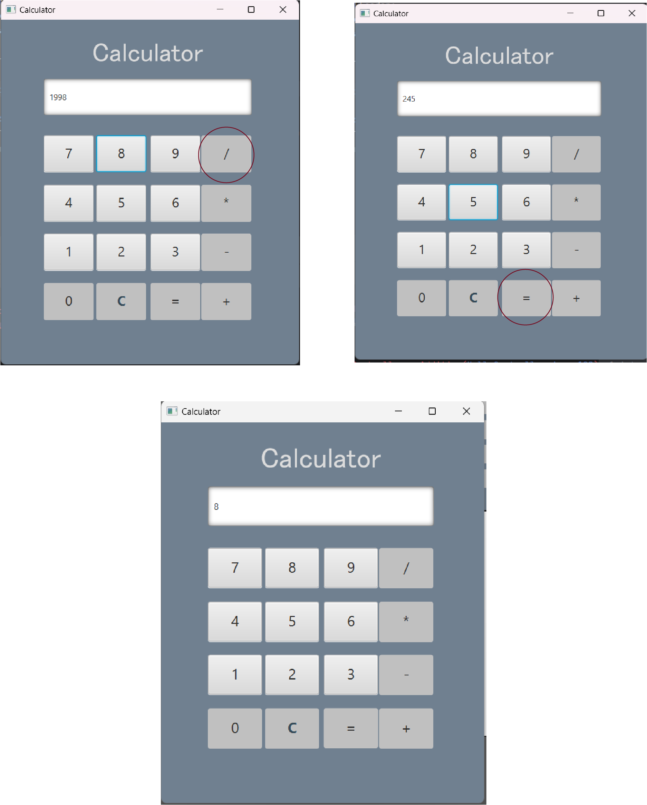

# Documentation for the "CalculatorApp" Project

## Calculator Class
The Calculator class is responsible for performing basic arithmetic operations. It provides methods to set operands and the operator, as well as a method to execute the calculation.

Fields:
-int op1: the first operand.
-int op2: the second operand.
-char operator: the operator that determines the type of operation (+, -, *, /).
-int result: the result of the calculation.  

## Methods:
- void calculate(): performs the calculation based on the values of op1, op2, and the operator. If the operation is division by zero, an ArithmeticException is thrown.
- Getters and Setters: methods to get and set the values of op1, op2, operator, and result.

## Hello-view.fxml
This file defines the graphical user interface (GUI) of the application using JavaFX. The main interface elements are:

- TextField display: used to display the input values and the result of calculations.
- Buttons for number input (0–9) and performing operations: [+, -, *, /] arithmetic operations.
- [=] to calculate the result.
- [C] to clear the display.
The buttons are organized in a GridPane, and each is linked to the corresponding method in the controller using the onAction event.

## HelloApplication
The HelloApplication class is responsible for starting the application and loading the interface defined in hello-view.fxml.

- Method start(Stage stage): loads the FXML file and sets the scene with dimensions of 320x240 pixels. It sets the window title to "Calculator" and displays the window.
- Method main(String[] args): the entry point of the program, calls the launch() method to start the JavaFX application.

## HelloController Class
The HelloController class manages user interaction with the calculator's interface. It handles button clicks and connects them to the appropriate actions:

- Field Calculator calc: an instance of the Calculator class to perform operations.
- Field TextField display: a text field for displaying data.
- Methods for handling number button clicks (but1(), but2(), etc.): append the corresponding number to the current content of the text field.
- Methods for arithmetic operations:
1. onAddition(): sets the + operator and stores the first operand.
2. onSub(): sets the - operator and stores the first operand.
3. onMultiply(): sets the * operator and stores the first operand.
4. onDivision(): sets the / operator and stores the first operand.
5. Method onCalculate(): performs the calculation based on the entered operand values and the operator, then displays the result in the text field.
6. Method OnClear(): clears the text field.
   

